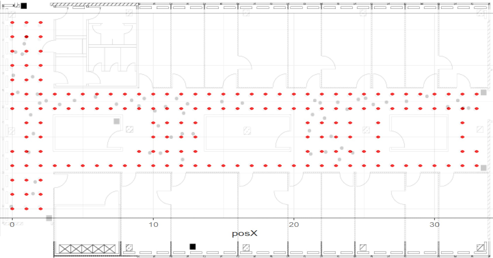

1. Describe your data
2. Describe the basic variable component of your data
3. Report the various findings you have established so far, with interpretation (include discussion on what you find and add how useful it is to your project objective)
4. Discuss any challenges you encountered, and ways by which you handled these.

```{r setup, include=FALSE}
knitr::opts_chunk$set(echo = FALSE)
library(kableExtra)
library(tidyverse)
library(here)
```

# 1. Introduction - Data Description

Indoor position systems (IPS) development is an active area of research that can be used in numerous settings. Part of efforts to develop, calibration and model these systems are achieved through the use of WIFI signals. The following report, describes and characterizes a large data set compiled in a 15 by 36 meter area that contains six (wifi routers) access points, signal strength, various locations and orientation of the devices (10 parameters total)
The data is subdivided in two sub-sets, one denominated "offline data", which corresponds to various testing devices connected to the network at different locations and orientations, and the other an "online data", where 60 locations and orientations of the devices were selected at random.

The offline data was collected designing a 1 meter resolution grid, resulting in 166 locations. In each of these locations, the device was oriented starting at 0 degrees inclination and at 45 degrees increments, and the strength signal measured. Furthermore, each combination of location/orientation was sampled 110 times. This grid sampling is intended to be used to calibrate a indoor positioning model. On the other hand, the online data was designed to simulate real-world data, in which locations are not bounded by the 1 meter grid used in the offline data, and were selected at random. This randomization included the orientation of the device and therefore, the online data consists of 60 randomly selected location/orientation combinations sampled 110 times. 

More details of the floor plan, and location of online and offline data can be seen in Figure 1.

For simplicity, this report will share the results found in the offline dataset, but initial process of data cleaning can be directly applied to the online data as well. The online and offline data sets share the same structure, so we explore the offline data set with the expectation to apply the same method for the online data set.

```{r fig.align = "center", fig.cap= 'Flooplan location. Access points are squares. Grey dots are offline data locations and black dots are online data locations.', out.width="100%", out.height="100%"}

knitr::include_graphics("data/floorplan.jpg")

#Ideally the figure should be bigger!
```


Circles serve as markers for the positions where "offline" measurements were conducted, while black squares indicate the locations of six access points. These reference positions provide a calibration of signal strengths within the building, forming the basis for constructing a model to predict the whereabouts of a hand-held device when its location is unknown. The hand-held device supplies x and y coordinates, akin to latitude and longitude on a map, along with its orientation. Signal strengths are recorded at eight orientations in 45-degree intervals. For every location and orientation combination, 110 signal strength measurements were documented for each of the six access points.


# 2. Data Processing

In this section, we provide a brief description of steps undertaken to format and clean the data set.

## 2.1 Variable Description

According to documents provided by the client, the data contains the following variables:

* `time`: time in miliseconds since midnight 01/01/1970 UTC

* `scanMac`: IP address of the scanning device. 

* `pos`: the 3-D coordination of the scanning device (x,y,z) 

* `orientation`: the scanning device's orientation. 

* `mac`: the IP address of the access points. 

* `signal`: signal strength in dBm. 

* `channel`: the channel frequency. 

* `type`: type of device (access point = 3, device in adhoc mode =1)  

## 2.2 Data formatting


```{r read_offline_data}

#Read the offline data txt file, with each row in the txt file becoming a text string
raw_offline = readLines("Data/offline.final.trace.txt")
```


The data are stored in a .txt file separated by both hash symbols and semicolons. A sample of the initial format of the data can be seen below.

```{r}

raw_offline[1:3]
unlist(strsplit(raw_offline[4], "(?<=[;])", perl = TRUE))
```

We note a pattern in the internal organization of the data that we use to properly format it.

* The first three rows, are characterized by the # symbol and mark the limit between each combination of location/orientation (i.e., each location sampling is delimited by 3 hash symbols). 

* The data rows contains a series of variables and values, separated by semicolons. We performed a simple split using semicolon as the separator, and found that some variables, such as `pos` and `mac` are further subdivided. Each `pos` value corresponds to a set of x, y, and z coordination. Each `mac` value corresponds to readings of `signal`, `channel`, and `type` respectively. 


```{r data_explanation, comment = ''}

raw_offline[1:3]
toPrint = strsplit(raw_offline, "[;]")[[10]]
head(toPrint)

#kbl(toPrint, caption = "Raw Data Format") %>% kable_classic(full_width = F, html_font = "Cambria", font_size = 10)
```

Since the model is supposed to rely on wifi signal strength to predict device location, we organized the data so each observation corresponds to one `signal` value by performing the following operations:
 
* First, we removed the rows with the "#" symbol that mark the beginning of a location sampling/orientation sample. As a result, a total of 5312 rows were removed, resulting in 146,080 rows.  

* Second, we utilized semicolon, colon, and equal sign, as separators for the different variables in each row and re-formatted the data so each row represents an observation of the variable signal strength.  

* Lastly, we binded all rows together to create a data frame. Subsequently, we entered the proper names for each variable.  

A sample of the first 3 rows is depicted below. 

```{r split_one_line, eval = FALSE}

#Exploration, do not run or eval for the document!

#The code below took all the separation out of one line. We take line 1 as an example and our separators are ; , and =
# separator = strsplit(clean_offline[1], "[;,=]") [[1]]
# separator
# 
# #The code below takes the time, id, pos, and degree readings out of "line" and arrange them in a matrix
# aa = separator[c(2,4,6,7,8,10)] %>% 
#   matrix(ncol=6,byrow=TRUE)
# aa
# 
# #The code below takes the mac, signal, channel, and device type reading out of "line" and arrange them in a matrix
# bb= separator[-(1:10)] %>%
#   matrix(ncol=4, byrow=TRUE)
# bb
# 
# #After this, we can combine the two matrices into a data frame. Our unit of analysis is signal strength, which mean each signal strength value needs to be one single observation. So to combine the data, we need to duplicate `a` by the number of rows in `b`.
# 
# aaa = separator[c(2,4,6,7,8,10)] %>% 
#   matrix(ncol=6,nrow=nrow(bb), byrow=TRUE)
# 
# cbind(aa,bb) %>% view()
```

```{r clean_#_rows, echo = FALSE, comment = ''}

# The code below removes all rows that start with #
clean_offline <- raw_offline[substr(raw_offline,start=1, stop=1) != "#"]
#After this code, clean_offline has 146,080 rows, less than the original 151,392 rows

#Create a clean_function to split each row into variables and put the variables into a matrix format
clean_function = function(raw_data){
  #check first element of the 2d array created -> row of observation
  separators = strsplit(raw_data, '[;=,]')[[1]]
  critical_val = 10
  if (length(separators) == critical_val)
    return (NULL)
  #separate variables related to the devices!
  devices = matrix(separators[-(1:10)], ncol = 4, byrow=TRUE)
  #only the ones that have info
  cbind(matrix(separators[c(2,4,6,7,8,10)], 
               nrow = nrow(devices), ncol = 6, byrow = TRUE), devices)
}

#Apply clean_function to the whole clean_offline dataset
clean_dataframe = lapply(clean_offline, clean_function)

#covnert list into dataframe -> we need the do.call function
clean_offline = as.data.frame(do.call(rbind, clean_dataframe))

#add names
names(clean_offline) = c("time", "scanMac", "posX", "posY", "posZ", "orientation", "mac", "signal", "channel", "type")
```

We provide the structure of our data frame, along with the first 3 observations below.

```{r echo = FALSE, message= FALSE}
clean_offline[1:3,]
```

Before further exploring and analyzing the data, we conducted a simple assessment to convert variables into the correct types defined in the documentation provided by the client. We performed the following operations:

* We converted the variables `time`, `position`, `orientation`, `signal` and `channel`, to numerical values.

* We then transformed the `time` variable. According documents provided by the client, time is expressed in milliseconds from midnight on January 1st, 1970. We convert this time value to seconds and then designate the class of the time element to visualize the values as date-times in R. We retained the more precise time information in `rawTime` in case it becomes necessary for future analysis.

* Based on the documents received from the client, a value of 1 for the variable `type` corresponds to ad-hoc devices. However, for the development and testing of the IPS, we will utilize only the signals measured at fixed access points. We removed all rows that have `type = 1`. This operation removed 203,185 observations, resulting in a new data set of 978,443 observations for all access point devices. We then eliminate the `type` variable (now equal to 3 in the entire data set).

*We also removed the `scanMac` column because the documentation provided indicates only one device was used for the experiment.

A sample of the formatted data set can be seen in Table 1.


```{r formatting_df, echo = FALSE}
#Turn some variables into numeric
numeric_var = c("time","posX","posY","posZ","orientation","signal", "channel")

clean_offline = clean_offline %>% mutate_at(c("time", "posX","posY", "posZ", "orientation", 'signal', 
                                        "channel", 'time'), as.numeric)
#Run this chunk only once, because else the dataframe will further divide time and the resulting variable will be a date in 1970

clean_offline$rawtime = clean_offline$time

#transitional df to prevent bugs
time_df = clean_offline  %>% mutate(time = time/1000)  %>% mutate(time = as.POSIXct(time, origin = '1970-01-01'))


#Keep access point devices only
OffLine = time_df[time_df$type == "3", ]
OffLine = OffLine[, "type" != names(OffLine)]

#to plot further ahead, feel free to ignore
dev = OffLine
OffLine = OffLine[, "scanMac" != names(OffLine)]

kbl(head(OffLine), caption = "Data with transformed variables", position="b") %>% kable_classic(full_width = F, html_font = "Cambria", font_size = 6)

```


# 3 Data exploration

This section focus on the exploration of the data itself. 

```{r echo = FALSE, message= FALSE}
#check numerical data
mean_off = OffLine %>% select(posX, posY, posZ, orientation, signal)
mean_off_p = colMeans(mean_off)

kbl(mean_off_p, caption = "Numerical variables mean", col.names = "Mean") %>% kable_classic(full_width = F, html_font = "Cambria", font_size = 10)

```


We conduct a basic exploration of the mean values of the numerical variables (i.e., position, orientation, signal). The results are provided in Table 2.

## Position

We found that position-z, has a mean of zero. Further exploration shows that the variable has a value of zero for all the observations in the offline data set. This seemingly anomalous value is due to the fact that all of the readings were taken on one floor of the building. We, therefore, removed the posZ variable from the data set.


```{r posZ, echo = FALSE, message= FALSE}
#Let's keep posZ because it is a meaningful pos variable that could be in our model, and we don't know if the online dataset has other values for posZ.

#Check min,max andmean vals for posZ 
meanposZ = mean(OffLine$posZ)
maxposZ = max(OffLine$posZ)
minposZ = min(OffLine$posZ)
#plot min,max, mean vals for posZ
posZdf = data.frame(meanposZ, maxposZ, minposZ)  
#kbl(posZdf, caption = "Min, Max and Mean values for posZ") %>% kable_classic(full_width = F, html_font = "Cambria", font_size = 10)

# # Set up a more visually appealing boxplot
# boxplot(OffLine$posZ, col = "skyblue", main = "Distribution of Z-axis Position", ylab = "Z-axis Position")
# abline(h = mean(OffLine$posZ), col = "red", lwd = 2)
# legend("topright", legend = "Mean", col = "red", lwd = 2)
# par(mar = c(5, 4, 4, 2) + 0.1)
# grid()
# axis(1, cex.axis = 0.8)
# axis(2, cex.axis = 0.8)
```


```{r table, echo=FALSE}


kbl(mean_off_p, caption = "Mean values for numerical variables", col.names = "Mean") %>% kable_classic(full_width = F, html_font = "Cambria", font_size = 10)

kbl(posZdf, caption = "Values for posZ", col.names = c("Mean", "Max", "Min")) %>% kable_classic(full_width = F, html_font = "Cambria", font_size = 10)
```

```{r echo = FALSE, message= FALSE}
OffLine = subset(OffLine, select = -posZ)
```


## Orientation of hand-held devices

As provided by the client, the orientation of the hand-held device going in increments of 45 degrees. We plotted 
supposed to be a set of exactly eight angles from 0 - 315 degrees in increments of 45 degrees. However, in practice, the measured orientations slightly deviate from these eight values. To further examine the distribution of the 'orientation' variable, we will analyze it through an empirical cumulative distribution function (ECDF).

```{r orientation_plot, echo = FALSE, message= FALSE}
# Plot the orientation of the measurement device
#plot(ecdf(clean_offline$orientation)) #clean_offline contains the adhoc device as well. Unless you have specific reasons here, I wouldn't display this one, only the plot below that works on OffLine.

#Create the ecdf plot for the variable orientation
plot(ecdf(OffLine$orientation),
     main = "Distribution of the Orientation variable",
     xlab = "Orientation",
     ylab = "Cumulative probability",
     xlim=c(0,360),
     lab=c(8,11,5), #I tried to make the x-axis ticks appear at 0, 45, 90 but it didn't work
     frame.plot=FALSE)

```

From the plot, we observe a concentration of observations around 0, 45, 90 degrees, and so forth. However, there is evident dispersion in between, with instances like 47.5 degrees, 358.2 degrees, and so on. There is also a value of 360, which should be converted to 0. As instructed by the client, we group the orientation values into bins from 0 - 315 in increments of 45.

```{r orientation, echo = FALSE, message= FALSE}

#Develop and apply a function to convert orientation values
convert_orient <- function(orientation) {
  rec_orient <- round(orientation / 45) * 45
  rec_orient <- ifelse(rec_orient == 360, 0, rec_orient)
  return(rec_orient)
}

#Recode orientation values
OffLine <- OffLine %>% 
 mutate(orientation=convert_orient(orientation))

dev = dev  %>% mutate(orientation=convert_orient(orientation))

```

## Access points

The client provided a list of six access point locations. However, the data collected include `r length(unique(OffLine$mac))` access points. This problem arises from the scanning device catching signals from wifi routers on other floors and nearby. We tally the number of observations for each access point and found seven access points with significantly higher number of observations than other access points. 

We confirm the corresponding access points with the data provided by the client on the "Access Point Location" file and filter accordingly. Additionally, we add the data of the position values provided by the client to the data set. 

```{r tally_obs, echo=FALSE, message= FALSE}
#Tally mac and arrange in descending order
tally_obs = OffLine %>% 
  group_by(mac) %>%
  summarize(observations =n()) %>%
  arrange(desc(observations))

#create table
kbl(tally_obs, caption = "Number of observation by MAC address", col.names = c("MAC ID", "Observations"))  %>% kable_classic(full_width = F, html_font = "Cambria", font_size = 10)


#Compare obs with values given by client
mac_locs <- readr::read_table("accessPointLocations.txt", col_names = c("Macs", "posX", "posY"))
mac_locs = as.data.frame(mac_locs)

kbl(mac_locs$Macs, caption ="MAC addresses provided by client", col.names = "MAC ID") %>% kable_classic(full_width = F, html_font = "Cambria", font_size = 10)

#Extract the Macs name from mac_locs
macnames = mac_locs$Macs

#Subset filtered_df by macnames and create a new macIPS dataset
macIPS = subset(OffLine, mac %in% macnames)

#Check macIPS to confirm only 6 mac values remain
sacheck = macIPS %>% group_by(mac) %>% summarize(observations = n())
# 
mod_OffLine = macIPS %>% left_join(mac_locs, by = c("mac"="Macs")) %>% rename("mac_posX" = posX.y,
                                                                               "mac_posY" = posY.y,
                                                                               "posX" = posX.x,
                                                                               "posY" = posY.x)
```
```{r echo = FALSE, message= FALSE, eval = FALSE}
#mod_OffLine
```

To confirm the list of access points, we match them with the channel's frequency. Since each access point coordinates with only one channel, we do not need the `channel` variable for our model.


```{r echo = FALSE, message= FALSE, results = "hide"}
#Find coordinating mac-channel

vis1 = mod_OffLine %>% group_by(mac, channel) %>% summarize ()
#Dropping the channel variable in the data set
mod_OffLine = subset(mod_OffLine, select = -channel)
```

```{r}

kbl(vis1, caption = "Grouped MAC addresses and corresponding channel", col.names = c("MAC ID", "Channel")) %>% kable_classic(full_width = F, html_font = "Cambria", font_size = 10)
```

## Visualization

We first explored the relationship between number of measurements and position in the floor plan.
Figure 2 depicts the relationship between position on the x,y axis and the number of observations. We observe that the observations are not equally distributed. It's possible that part of the information in the sample was tainted by significant noise that was subsequently removed by the exploration process.  Additionally, we plot the locations on the floor map, and confirm they overlap (Fig 3). 

```{r obs_loc_plot, echo = FALSE, fig.align = "center", fig.cap= 'Heat map of strength signal samples by location', out.width="100%", out.height="100%"}

mod_OffLine %>% ggplot(aes(posX, posY)) + geom_bin2d(bins=10) + labs(title="Heatmap of Observations by Location", x="x-coordinate", y="y-coordinate") + theme_minimal()


#scale_fill_continuous(type = "viridis")
```
```{r fig.align = "center", fig.cap= 'Flooplan location and offline data location. We see the data cleaning was sucessful in eliminating unwanted variables while preserving the geographical information', out.width="100%", out.height="100%"}



#Ideally the figure should be bigger!
```

We analyzed the possibility of certain locations on the map having a higher median signal strength, to assess potential bias (Fig. 4). We note that the orientation angle doesn't not seem to be correlated with signal strength, but position does have an effect on the observed median strength. This is because of the geographical distribution of the access points (wifi router) across the area sampled. Naturally, the strength signal will decrease as the device moves away from the router. The limitation of the plot (2D) do not allow to examine the variability on the distribution on the x-axis.

```{r summary_by_combo, echo=FALSE, message =FALSE, fig.align = "center", fig.cap= 'Heat map of strength signal grouped by orientation ', out.width="100%", out.height="100%"}
# Group and summarize the data to obtain median, mean, and standard deviation for signal strength
summary_data = mod_OffLine %>%
  group_by(posX, posY, orientation, mac) %>%
  summarise(
    median_signal = median(signal),
    mean_signal = mean(signal),
    sd_signal = sd(signal)
  )

heatmap_plot = ggplot(summary_data, aes(x = orientation, y = as.factor(posY))) +
  geom_tile(aes(fill = median_signal), color = "white") +
  labs(title = "Signal Strength Heatmap grouped by Orientation vs. Location",
       x = "Orientation Angle",
       y = "Location",
       fill = "Median Signal Strength")

heatmap_plot
```

To explore further the distribution of signal strength in the data, we created several boxplots. We start by grouping them by `mac` and unique position x, and position y combinations. The objective is to analyze if certain location on the area sampled have anomalous signals, and how they compare to other access points. The results are depicted in Figure 5. We note that some of this variability might be explain because of the distances to the access points. This information will become important to further create the indoor positioning model. 

We expect that strength signal is not being greatly influenced by the effect of orientation. On figure 4 we approached this problem including location, and then further explored the idea on figure 5. Because we found some significant differences - most likely because the proximity to the router - we explore the relation between the access point, signal strength and orientation. The resulting box plot is shown in Figure 6. We see that, in general, signal strength does not vary greatly depending on the orientation, with the exception of some outliers. 
Lastly, we created a heat map of the strength signal by location (Fig 6). Figure 6 serves as a map of proximity to the access points (See Floor plan figure)


# 4. Results

The resulting exploration allows us to conclude several things:

1) Orientation doesn't seem to heavily influence strength signal
2) Distance to the device is an important factor of signal strength
3) Some access points have weaker signals in general - most likely, the ones located at the extremes on the area where the experiment was conducted -. 


```{r heatmap2, echo=FALSE, message =FALSE, fig.align = "center", fig.cap= 'Heat map of strength signal grouped by orientation ', out.width="80%", out.height="80%", warning=FALSE, message =FALSE}

#create a loc, coordinates
library(MASS) 
library(reshape2) 
library(reshape) 

new_combIPS = mod_OffLine[, -1]
new_combIPS = new_combIPS %>% mutate(location = Map(c, posX, posY))


#ggplot(new_combIPS, aes(x = posX, y = signal, group_by=factor(posY))) + geom_boxplot() + facet_grid(mac~grouped_orient)

ggplot(new_combIPS, aes(x = posX, y = signal, group=posY)) + geom_boxplot(width =25, lwd=0.5, outlier.colour = 'skyblue', alpha = 0.4)  + facet_grid(mac~orientation) + theme_bw(base_size=5) + theme(axis.text.x=element_text(angle = 90, hjust = 1, vjust = 1, size = 4)) + scale_x_continuous(n.breaks = 15) +xlab('locations') + ggtitle("Signal strength by location and orientation")

```


```{r or_sigboxplots, echo=FALSE, message =FALSE, fig.align = "center", fig.cap= 'Boxplots for Signal and Orientation grouped by Access Point ', out.width="80%", out.height="80%", warning=FALSE, message =FALSE}

ggplot(mod_OffLine, aes(x= orientation, y= signal, group_by= orientation, fill = orientation)) + geom_boxplot(aes(group=orientation)) + facet_wrap(~mac) + ggtitle("Signal strength by orientation, grouped by access point") + theme(legend.position="none")

```
```{r heat_map_floorplan, echo=FALSE, message =FALSE, fig.align = "center", fig.cap= 'Boxplots for Signal and Orientation grouped by Access Point ', out.width="80%", out.height="80%", warning=FALSE, message =FALSE}


ggplot(mod_OffLine, aes(posX, posY, group= signal)) + geom_point(aes(color = signal, size = 5))  +xlab('Position X') + ylab("Position Y") + ggtitle("Signal strength by location") + theme(legend.position="none")

#ggplot(mod_OffLine, aes(x=posX, y=posY) ) + geom_hex(aes(group=signal)) + theme_bw()
```
# 5. Challenges 

This section discusses challenges we encountered exploring the Indoor Positioning data.

## Data formatting

The data the client provided is not in a format ready for analysis. The data file had multiple characteristics that need significant re-formatting:

* It is a text file with minimal formatting.

* The data was not presented in a table format and variables are separated by multiple different separators.

* Each line corresponds to multiple observations and the number of observations on each line is different.

The data formatting process took significant amount of time and required us to learn new functions

## Data exploration

* There are different counts between MAC addresses and channels. From the txt file, we realized that there are extra access points that are not included in the testing area. 

* We found that there is a one to one relationship between MAC address and channel for the seven devices. We had to delete channel from the 'offline' data set.
