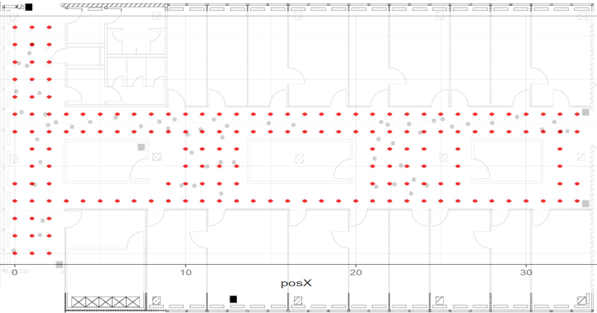

1. Describe your data
2. Describe the basic variable component of your data
3. Report the various findings you have established so far, with interpretation (include discussion on what you find and add how useful it is to your project objective)
4. Discuss any challenges you encountered, and ways by which you handled these.

```{r setup, include=FALSE}
knitr::opts_chunk$set(echo = FALSE)
library(kableExtra)
library(tidyverse)
library(here)
```

# 1. Introduction - Data Description


Indoor position systems (IPS) development is an active area of research that can be used in numerous settings. An area of interest is the use of using signal strength from WIFI routers to estimate the location of a device. 

The following report, describes and characterizes a large data set compiled in a 15 by 36 meter area that contains the data obtained from a handheld device connected to a WIFI network, in different locations and orientations, in order to create a model to predict indoor positioning. 

The data is subdivided in two sub-sets, one denominated `offline` data, which corresponds to a testing device connected to the network at different locations and orientations, and the other an `online` data, where 60 locations and orientations of the devices were selected at random. 

The `offline` data, intended to train a model, was collected designing a 1 meter resolution grid, resulting in 166 locations. In each of these locations, the device was oriented starting at 0 degrees inclination and at 45 degrees increments (for a total of 8), and the strength signal measured for each access point was measured 110 times. That is, per each location (x,y) we have 110 samples at each angle, for a total of `r 110 * 8` samples per location, and a total of `r 110 * 8 * 166` observations. 

The `online` data was designed to simulate real-world data (i.e., locations that are not bounded to a grid, and which a device can be oriented at random.) Specifically for the online data, 60 combinations of orientation/locations were randomly selected, and then sampled 110 times, resulting in `r 60 * 110` measurement in total.


More details of the floor plan, and location of `online` and `offline` data can be seen in Figure 1.Circles serve as markers for the positions where `offline` measurements were conducted, while black squares indicate the locations of the six access points. The positions of the access points were provided in a separate file by the client. 

For simplicity, this report will share the results found in the `offline` data set, but initial process of data cleaning can be directly applied to the `online` data as well because both sets share the same format.


```{r fig.align = "center", fig.cap= 'Flooplan location. Access points are squares. Grey dots are offline data locations and black dots are online data locations.', out.width="100%", out.height="100%"}

knitr::include_graphics("data/floorplan.jpg")

#Ideally the figure should be bigger!
```

# 2. Data Processing - Describe the basic variable component of your data

This section provides the description of the data itself, and summarizes the steps of cleaning the data set, including basic statistic exploration.


## 2.1 Variable Description

According to documents provided by the client, the data contains the following variables:

* `time`: time in miliseconds since midnight 01/01/1970 UTC

* `scanMac`: IP address of the scanning device, in mm:mm:mm:ss:ss:ss.

* `pos`: the 3-D coordination of the scanning device (x,y,z) 

* `orientation`: the scanning device's orientation. 

* `mac`: the IP address of the access points. 

* `signal`: signal strength in dBm. 

* `channel`: the channel frequency. 

* `type`: type of device (access point = 3, device in adhoc mode =1)  


## 2.2 Data formatting

The raw data are stored in a .txt file. The first 3 lines of the data are characterized by the hash (#) symbol, followed by a row that contains all the variables in one line, separated by a semi-colon. A sample of the initial format of the data can be seen below. We start by eliminating the rows that start with the hash symbols from the data set using a `strsplit` function. The resulting data set contains a total of 146080 rows, and therefore `r 151392 - 146080` rows were eliminated. This value, if divided by 3 (first 3 rows contain a hash) is 1770, which is close consistent with the expected number of locations (166) and angles (8). This means that each stack location/orientation combination that contains 110 samples (from herein `Location_orientation stack`) was separated by 3 hash symbols. 

```{r read_offline_data, echo =FALSE, comment=''}

#Read the offline data txt file, with each row in the txt file becoming a text string
raw_offline = readLines("Data/offline.final.trace.txt")
#print first 3 rows
#raw_offline[1:3]
#exclude hash symbol rows
noHash = raw_offline[substr(raw_offline,start=1, stop=1) != "#"]
#print 3 rows to show semi colon sep variables
unlist(strsplit(raw_offline[4], "(?<=[;])", perl = TRUE))
```

Some variable names do not correspond to the ones given by the client, for example, `orientation` is `degree` in the data set, and the variables `type`, `channel`, `signal` do not have an explicit name. We also note that for `pos` the x,y,z variables are grouped together, and the `mac` variable includes `signal`, `channel` and `type` separated by comas. We can then distinguish between single variables (defined by a name and have one value), and secondly composite variables (defined by containing multiple values for one parameter).

The results of the `strplt` function on one row can be seen bellow.

```{r data_explor_single, comment = '', echo=FALSE}
#Exploration
#separate by semi-colon, equal and com
separate_semicolon = strsplit(noHash, '[;]')
separate_all = strsplit(noHash, "[;=,]")[[3]]
separate_all
#sep_equal = strsplit(noHash, '[=,]')[[1]]

#separators = strsplit(raw_data, '[;=,]')[[1]]
#devices = matrix(separators[-(1:10)], ncol = 4, byrow=TRUE)
#only the ones that have info
#cbind(matrix(separators[c(2,4,6,7,8,10)], nrow = nrow(devices), ncol = 6, byrow = TRUE), devices)

```


We use these patterns to create a matrix with the variables. For this, we created a function that first, separated all the data separated by a semi-colon, a comma, or an equal symbol. Then, we selected the rows corresponding to `mac`, `signal`, `type` and created a matrix that has the information for the specific access point. Lastly, we bind all the information together in a large data frame that contains one row per location/orientation and access point.

We provide the structure of our data frame, along with the first 3 observations below.


```{r clean_#_rows, echo = FALSE, comment = ''}

# The code below removes all rows that start with #
clean_offline <- raw_offline[substr(raw_offline,start=1, stop=1) != "#"]
#After this code, clean_offline has 146,080 rows, less than the original 151,392 rows

#Create a clean_function to split each row into variables and put the variables into a matrix format
clean_function = function(raw_data){
  #check first element of the 2d array created -> row of observation
  separators = strsplit(raw_data, '[;=,]')[[1]]
  critical_val = 10
  if (length(separators) == critical_val)
    return (NULL)
  #separate variables related to the devices!
  devices = matrix(separators[-(1:10)], ncol = 4, byrow=TRUE)
  #only the ones that have info
  cbind(matrix(separators[c(2,4,6,7,8,10)], 
               nrow = nrow(devices), ncol = 6, byrow = TRUE), devices)
}

#Apply clean_function to the whole clean_offline dataset
clean_dataframe = lapply(clean_offline, clean_function)

#covnert list into dataframe -> we need the do.call function
clean_offline = as.data.frame(do.call(rbind, clean_dataframe))

#add names
names(clean_offline) = c("time", "scanMac", "posX", "posY", "posZ", "orientation", "mac", "signal", "channel", "type")

clean_offline[1:3,]
```

## 2.3 Data Transformation

Before further exploration and analysis of the data, we conducted converted the variables into the correct types (as defined by the documents provided by the client). 

The summary is as follows:

1) The variables `position`, `orientation`, `signal` and `channel` were converted to numerical values.
2) The variable `time` was converted into a time value using as origin midnight on January 1st, 1970. The original variable was kept in the data set as `rawTime` in case it becomes necessary for future analysis.
3) The variable `type` has binary values of 1 and 3. The documentation explains that `type = 3` corresponds to ad-hoc devices, that are not needed for the development and testing of the IPS and therefore, after removing the rows with a value of `type` equal to 3, we remove the variable from the data set.
4) For the exploration, we remove the `scanMac`, as information given by the client indicates that one devices was used.


The first rows of the formatted data can be seen in Table 1.

A quick analysis of the numerical data shows that posZ has only zero values (Table 2). This seemingly anomalous value is due to the fact that all of the readings were taken on one floor of the building. We, therefore, removed the posZ variable from the data set. Furthermore, we detect anomalous values for orientation that we report in the next section.


```{r formatting_df, echo = FALSE}
#Turn some variables into numeric
numeric_var = c("time","posX","posY","posZ","orientation","signal", "channel")
num_notime = c("posX","posY","posZ","orientation","signal", "channel")

clean_offline = clean_offline %>% mutate_at(c("time", "posX","posY", "posZ", "orientation", 'signal', 
                                        "channel", 'time'), as.numeric)
#Run this chunk only once, because else the dataframe will further divide time and the resulting variable will be a date in 1970

clean_offline$rawtime = clean_offline$time

#transitional df to prevent bugs
time_df = clean_offline  %>% mutate(time = time/1000)  %>% mutate(time = as.POSIXct(time, origin = '1970-01-01'))


#Keep access point devices only
OffLine = time_df[time_df$type == "3", ]
OffLine = OffLine[, "type" != names(OffLine)]

#to plot further ahead, feel free to ignore
dev = OffLine
OffLine = OffLine[, "scanMac" != names(OffLine)]

#stat num values
num_data = OffLine %>% select(all_of(num_notime))
summary_num = summary(num_data)

#remove posZ
OffLine = subset(OffLine, select = -posZ)


t1 = kbl(head(OffLine), caption = "Data with transformed variables", position="b") %>% kable_classic(full_width = F, html_font = "Cambria", font_size = 6)

t2 = kbl(summary_num, caption="Numerical Data Summary")  %>% kable_classic(full_width = F, html_font = "Cambria", font_size = 6) %>% 
  column_spec(4, color = "red")

t1
t2
```


# 3. Data exploration

This section focus on the exploration of the data itself. 


## 3.1 Orientation of hand-held devices

As shown in Table 2, the max value for `orientation` corresponded to 355.9 degrees. As provided by the client, the orientation of the hand-held device going in increments of 45 degrees. However, in practice, the measured orientations slightly deviate from these eight values (Fig. 2). We attribute this to human or measurements error, and decide to modify the data and approximate the orientations to those closer to their 45 degree angles. 


```{r histogram_count, echo = FALSE, fig.cap="The figure corresponds to a histogram of the orientation. Here, it can be seen that some orientation fall outside the 45 degree increments, most likely because of errors in measurements or problems in having a consistent angle"}

ggplot(OffLine, aes(orientation)) + geom_histogram(bins=80) + scale_x_continuous(breaks=seq(0,360,45)) + theme_bw() + ggtitle("Orientation Histogram") +xlab("Orientation") +ylab("Count")
```

```{r orientation, echo = FALSE, message= FALSE}

#Develop and apply a function to convert orientation values
convert_orient <- function(orientation) {
  rec_orient <- round(orientation / 45) * 45
  rec_orient <- ifelse(rec_orient == 360, 0, rec_orient)
  return(rec_orient)
}

#Recode orientation values
OffLine <- OffLine %>% 
 mutate(orientation=convert_orient(orientation))

dev = dev  %>% mutate(orientation=convert_orient(orientation))

```

## 3.2 Access points

The client provided a list of six access point locations (Table 3). However, the data collected includes `r length(unique(OffLine$mac))` access points. This problem arises from the scanning device catching signals from wifi routers on other floors and nearby. We tally the number of observations (Table 4) for each access point and found seven access points with significantly higher number of observations than other access points. 

We confirm the corresponding access points with the data provided by the client on the "Access Point Location" file and filter accordingly. Additionally, we add the data of the position values for the access point provided by the client to the data set. This allows us to track the location of the place where the sample was taken and the location of the access device emitting the signal (Fig. 3). 

This will be useful for creating the model, as it will allow us to calculate the distance between the access point, the hand-held device, and signal strength.

```{r tally_obs, echo=FALSE, message= FALSE}
#Tally mac and arrange in descending order
tally_obs = OffLine %>% 
  group_by(mac) %>%
  summarize(observations =n()) %>%
  arrange(desc(observations))

#Compare obs with values given by client
mac_locs <- readr::read_table("accessPointLocations.txt", col_names = c("Macs", "posX", "posY"))
mac_locs = as.data.frame(mac_locs)

kbl(mac_locs$Macs, caption ="MAC addresses provided by client", col.names = "MAC ID") %>% kable_classic(full_width = F, html_font = "Cambria", font_size = 10) 

#create table
kbl(tally_obs, caption = "Number of observation by MAC address", col.names = c("MAC ID", "Observations"))  %>% kable_classic(full_width = F, html_font = "Cambria", font_size = 10)


#Extract the Macs name from mac_locs
macnames = mac_locs$Macs

#Subset filtered_df by macnames and create a new macIPS dataset
macIPS = subset(OffLine, mac %in% macnames)

#Check macIPS to confirm only 6 mac values remain
sacheck = macIPS %>% group_by(mac) %>% summarize(observations = n())
# 
mod_OffLine = macIPS %>% left_join(mac_locs, by = c("mac"="Macs")) %>% rename("mac_posX" = posX.y,
                                                                               "mac_posY" = posY.y,
                                                                               "posX" = posX.x,
                                                                               "posY" = posY.x)
```


```{r plot_2, echo=FALSE, fig.cap="Location of Hand-hel devices (black) and one access point (red). Adding the access point location makes easy to determine the distance between device and access point and relate it to signal strength and orientation", warning=FALSE, message=FALSE}

toplot2 = mod_OffLine%>% filter(mac == '00:14:bf:b1:97:8a')
ggplot(toplot2) + geom_point(aes(posX, posY)) + geom_point(aes(2.5, -0.8, color = "red"), show.legend = F) + theme(legend.position="none") + theme_minimal() + ggtitle("All Location of hand-held device and One Access Point") +xlab("x-coordinate") +ylab("y-coordinate")
```


To confirm the list of access points, we match them with the channel's frequency (Table 5). Since each access point coordinates with only one channel, we do not need the `channel` variable for our model.


```{r echo = FALSE, message= FALSE, results = "hide"}
#Find coordinating mac-channel

vis1 = mod_OffLine %>% group_by(mac, channel) %>% summarize ()
#Dropping the channel variable in the data set
mod_OffLine = subset(mod_OffLine, select = -channel)
```

```{r}

kbl(vis1, caption = "Grouped MAC addresses and corresponding channel", col.names = c("MAC ID", "Channel")) %>% kable_classic(full_width = F, html_font = "Cambria", font_size = 10)
```

# 4. Visualization

We first explore the relationship between number of measurements and position in the floor plan. Figure 4 depicts the relationship between position on the x, y axis and the number of observations. We observe that the observations are not equally distributed. It's possible that part of the information in the sample was tainted by significant noise that was subsequently removed during the exploration process.  

Additionally, we plot the locations on the floor map, and confirm they overlap (Fig 5). 

```{r obs_loc_plot, echo = FALSE, fig.align = "center", fig.cap= 'Heat map of strength signal samples by location', out.width="100%", out.height="100%"}

mod_OffLine %>% ggplot(aes(posX, posY)) + geom_bin2d(bins=10) + 
  labs(title="Heatmap of Observations by Location", x="x-coordinate", y="y-coordinate") + theme_minimal()

```
```{r fig.align = "center", fig.cap= 'Flooplan location and offline data location. We see the data cleaning was sucessful in eliminating unwanted variables while preserving the geographical information', out.width="100%", out.height="100%"}
#fig5


#Ideally the figure should be bigger!
```

We analyzed the possibility of a stronger median signal for certain access points on the map depending on the orientation of the device (Fig 6). We note that some access points, particularly `00:14:bf:b1:97:90` has a stronger median signal, while the lowest corresponds to `00:14:bf:b1:97:8d`. This might be because of the location of access point; some will be closer to the sampling locations, while others on the extreme will be further away. Naturally, the strength signal will decrease as the device moves away from the router. What's interesting to notice is that orientation does seem to be influence to signal strength, at least in the 50 percentile behavior.

```{r summary_by_combo_fig6, echo=FALSE, message =FALSE, fig.align = "center", fig.cap= 'Heat map of strength signal grouped by orientation ', out.width="150%", out.height="120%"}
#fig6
# Group and summarize the data to obtain median, mean, and standard deviation for signal strength
summary_data = mod_OffLine %>%
  group_by(posX, posY, orientation, mac) %>%
  summarise(
    median_signal = median(signal),
    mean_signal = mean(signal),
    sd_signal = sd(signal)
  )


heatmap_plot = ggplot(summary_data, aes(x=orientation, y=as.factor(mac))) + geom_tile(aes(fill=median_signal)) +
  labs(title = "Signal Strength Heatmap grouped by Orientation vs. Location", 
       x = "Orientation Angle",  y = "Mac", fill = "Median Signal Strength")

heatmap_plot
```

We have established that at least in the general behavior, orientation seems to influence signal strength. To further explore this, we create a box-plot lattice that:

1) Creates boxplots for each `mac` and `orientation` combination. 
2) Groups the individual box-plots by strength signal and orientation `posX`, `posY`.

This plot (Fig. 7) allows to visualize strength signal values depending on orientation. For better visualization we subdivide the plots by access point. 
groups the different access points, and creates box-plots grouped by signal strength and orientation. The figure shows mainly two things. The first is that some access points have consistently stronger signals, while other have median values that are significantly lower. The second is that there's not a consistent behavior of orientation and signal strength (i.e., the signal strength for some is higher at some orientations, and lower for others). The third is that the median value for the signal varies according to the orientation of the device. 

We also select one location `posX` and `posY` equal to zero, and explore the relation of signal strength and orientation, grouped by access point. The results are shown in figure 8. Here, we can see that signals are stronger for one access point, possibly because of proximity. Median values for angles greatly vary as well. 


```{r boxplot1, echo=FALSE, message =FALSE, fig.align = "center", fig.cap= 'Box-plot of signal strength depending on orientation, grouped by access point ', out.width="80%", out.height="80%", warning=FALSE, message =FALSE}

#create a loc, coordinates
library(MASS) 
library(reshape2) 
library(reshape) 

general_plot= ggplot(mod_OffLine, aes(as.factor(orientation), signal)) + geom_boxplot(outlier.colour = 'skyblue', alpha = 0.4) + facet_grid(~mac) + theme_bw() + theme(axis.text.x=element_text(angle = 90))  +xlab('orientation') + ggtitle("Signal strength by orientation grouped by access point")

general_plot
```

```{r fig.8.boxplot2, echo=FALSE, message =FALSE, fig.align = "center", fig.cap= 'Box-plot of signal strength depending on orientation, grouped by access point in row 5', out.width="80%", out.height="80%", warning=FALSE, message =FALSE}


one_loc = mod_OffLine %>% filter(posX==0)
one_loc_2 = mod_OffLine %>% filter(posY==0)

part_plot= ggplot(one_loc, aes(as.factor(orientation), signal)) + geom_boxplot(outlier.colour = 'skyblue', alpha = 0.4) + facet_grid(~mac) + theme_bw() + theme(axis.text.x=element_text(angle = 90))  +xlab('orientation') + ggtitle("Signal strength by orientation grouped by access point at  posX=0, posY=0")

part_plot
```

Lastly, we create a new column in the data frame that stores the distance between the access point and the hand-held device. A scatter plot of distance and signal strength is shown below (Fig. 9). The plot shows an inverse realtionship between signal strength and distance.

```{r dist_df, echo=FALSE, message = FALSE,  echo=FALSE, message =FALSE, fig.align = "center", fig.cap= 'Scatter-plot of signal vs distance grouped by access point', out.width="80%", out.height="80%", warning=FALSE, message =FALSE}

dist_df = mod_OffLine %>% dplyr::select(everything()) %>% mutate(x_dist = as.numeric(mac_posX) - as.numeric(posX), y_dist = as.numeric(mac_posY) - as.numeric(posY), 
                                                                 dist = sqrt(x_dist^2 + y_dist^2))


ggplot(dist_df, aes(x=dist, y=signal)) + geom_point() + facet_wrap(~mac) +geom_smooth()  + theme_minimal() +xlab('Distance') + ggtitle("Signal strength by distance between access point and hand-held device")
```

# 5. Results

The resulting exploration allows us to conclude several things:

1) Orientation seems to influence strength signal
2) Distance to the device is an important factor of signal strength and they are inversely related
3) Some access points have weaker signals in general; most likely, the ones located at the extremes on the area where the experiment was conducted.


# 6. Challenges 

This section discusses challenges we encountered exploring the Indoor Positioning data.


## 6.1 Data formatting


The data the client provided is not in a format ready for analysis. The data file had multiple characteristics that need significant re-formatting:

1) It is a text file with minimal formatting.

2) The data was not presented in a table format and variables are separated by multiple different separators.

3) Each line corresponds to multiple observations and the number of observations on each line is different.


These challenges were solved by learning about the `string` function.


## 6.2 Data exploration

1) There are different counts between MAC addresses and channels. From the txt file, we realized that there are extra access points that are not included in the testing area. 

2) We found that there is a one to one relationship between MAC address and channel for the seven devices. We had to delete channel from the 'offline' data set.


# 5.3 Lack of knowledge on the subject

None of the members of the team are experts or at least knowledgeable in IPS, so substantial learning had to be done to understand the data itself.